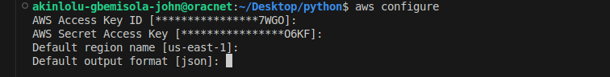
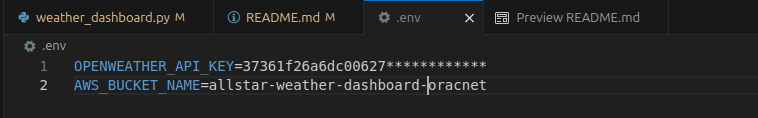
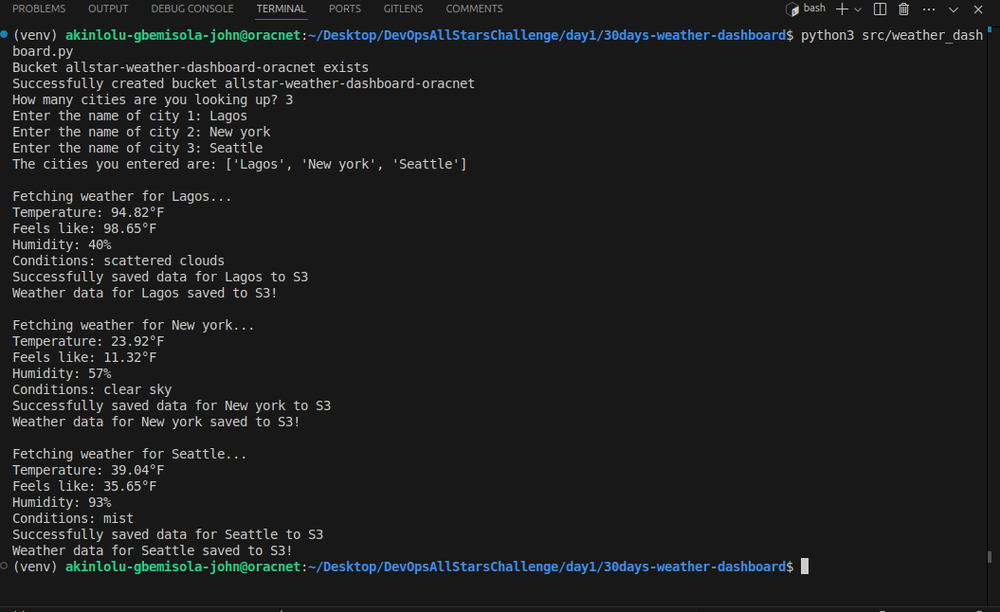

# 30 Days DevOps Challenge - Weather Dashboard

Day 1: Building a weather data collection system using AWS S3 and OpenWeather API

# Weather Data Collection System - DevOps Day 1 Challenge

## Project Overview
This project is a Weather Data Collection System that demonstrates core DevOps principles by combining:
- External API Integration (OpenWeather API)
- Cloud Storage (AWS S3)
- Infrastructure as Code
- Version Control (Git)
- Python Development
- Error Handling
- Environment Management

## Features
- Fetches real-time weather data for multiple cities
- Displays temperature (°F), humidity, and weather conditions
- Automatically stores weather data in AWS S3
- Supports multiple cities tracking
- Timestamps all data for historical tracking

## MODIFICATIONS 
  - Iterating the number of cities
  - Requesting User's Input of the City names

## 🛠️ Technical Architecture
- **Language:** Python 3.x 
- **Cloud Provider:** AWS (S3) ☁️
- **External API:** OpenWeather API
- **Dependencies:** 
  - boto3 (AWS SDK)
  - python-dotenv
  - requests

## Project Structure

```markdown
weather-dashboard/
  assets/
    aws_config.png
    env.png
    weather-dashboard.png
  src/
    __init__.py
    weather_dashboard.py
  tests/
  data/
  .env
  .gitignore
  requirements.txt
```

## What I Learned

  - AWS S3 bucket creation and management
  - Environment variable management for secure API keys
  - Python best practices for API integration
  - Git workflow for project development
  - Error handling in distributed systems
  - Cloud resource management

## Future Enhancements

  - Add weather forecasting
  - Implement data visualization
  - Add more cities
  - Create automated testing
  - Set up CI/CD pipeline

# HOW TO NAVIGATE ALL OF IT AS A BEGINNER
## PREREQUISITES

Before you can work on the project, you need to have certains things setup on your local machine. This includes but not limited to the following:
  - **VS code Editor** you can see documentation [here](https://code.visualstudio.com/download)
  - **AWS CLI Installed** you can see documentation [here](https://docs.aws.amazon.com/cli/latest/userguide/getting-started-install.html)

Next, you configure your `AWS CLI` with the `ACCESS KEY ID` and `ACCESS SECRET KEY` gotten from your `AWS` console `AM USER` by doing
 ```
 aws configure
 ```
paste your credentials as shown in the image below



## SETUP GUIDE

1. Clone the repository:
  ```
  git clone https://github.com/ShaeInTheCloud/30days-weather-dashboard.git
  ```

2. Create a Virtual Environment

  Before you install it's important you create a virtual environment for python. This wont install as the package is being handled externally. This could simply be `Apt`. So make sure to isolate the environment and install it within there.

  To do this:

  To create a virtual environment 

  ```
    python3 -m venv (your virtual environment name)
  ```

Then you have to activate the virtual environment 
    ```
    source envname/bin/activate
    ```

3. Install dependencies

   ```
   pip install -r requirements.txt
   ```

4. Configure environment variables (.env)

   ```
   OPENWEATHER_API_KEY=your_api_key
   AWS_BUCKET_NAME=your_bucket_name
   ```

    

6. Run the application:

   ``` 
   python src/weather_dashboard.py
   ```

   

